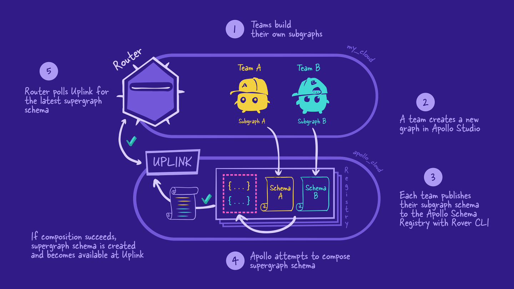
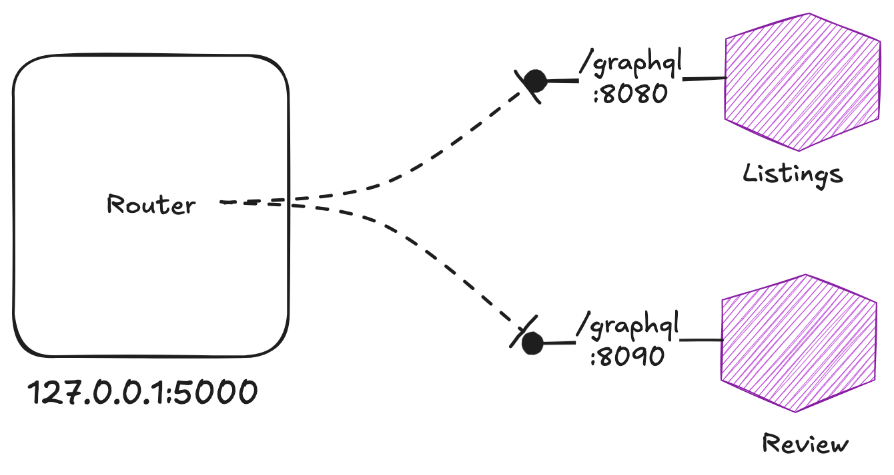

## How to use this repo

This project uses Java and requires JDK 17. To start the project, open a new terminal in the 
`listing` directory and the `reviews` directory and run:

`./gradlew bootRun`

## Overview

[Managed federation & the supergraph](https://www.apollographql.com/tutorials/voyage-part1/05-managed-federation-and-the-supergraph)

### Project overview

Follow the steps in the tutorial to publish subgraph and configure the router:

- [Publishing the subgraphs with Rover](https://www.apollographql.com/tutorials/voyage-part1/06-publishing-the-subgraphs-with-rover)
- [How the router resolves data](https://www.apollographql.com/tutorials/voyage-part1/07-how-the-router-resolves-data)

## GraphQL code generation with DGS

This project has been configured to use the Netflix DGS Codegen plugin.
[how to use the generated types](https://netflix.github.io/dgs/generating-code-from-schema/) to adapt the default setup.

